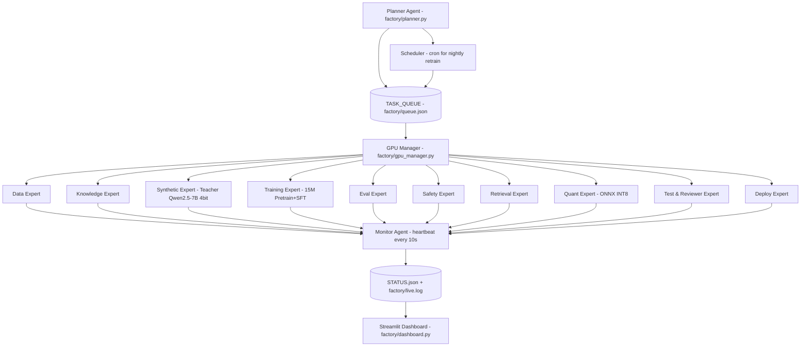

# KrushiVerseAI v3.0 — Autonomous Self-Managed Factory Plan
**Version:** v3.0-Autonomous | **Hardware:** RTX 2050 4GB + i5-13500H + 16GB RAM (Windows 11) | **Goal:** Zero-touch 15M prod model
**Philosophy:** You run ONE command `python -m factory.planner --auto` and 10 expert workers finish v2.0 for you. Minimal human work.

---

## 0. Executive Summary — What Changes from v2

v2 was manual sprints S18-S32 you run one by one. v3 is **self-running factory**:

- **Planner Agent** = Boss. Reads TASK_DAG.json, picks next ready job, assigns to expert worker.
- **GPU Manager** = VRAM lock for RTX 2050 4GB. Only ONE CUDA job at a time. Others use CPU.
- **10 Expert Workers** = Each runs as background process, writes heartbeat + status.
- **Monitor + Reporter** = Watches long jobs (pretrain 3hrs), updates `factory/STATUS.json` every 30s, shows live Streamlit dashboard.
- You = Reviewer who checks dashboard, not runner.

**Result:** You start factory at night, morning you have v0.8-agri-qa INT8 ready.

---

## 1. Hardware-Aware Autonomous Design for YOUR Machine

Your screenshot: CPU 12C/16T, RAM 11.8/15.7GB (75% used), RTX 2050 4GB @ 44C idle.

**Constraints we design for:**
1.  **RAM:** 16GB but you run Chrome. Real free = ~4GB. All data workers use streaming + chunk size 1000 lines, not load full file.
2.  **VRAM 4GB:** Cannot run 2 CUDA jobs parallel. GPU Manager implements MUTEX lock file `factory/gpu.lock`.
3.  **Windows:** No Docker needed. Use `python -m multiprocessing` + `torch.cuda`. No Redis.
4.  **Thermal:** Laptop throttles after 45min @100% GPU. Monitor checks temp >85C, pauses 5min.
5.  **Power cut:** All workers checkpoint every 500 steps + write WAL log. Resume on restart.

**GPU Scheduling Rule:**
```
IF task.type in [pretrain, sft, synthetic_teacher, eval_embedding] -> needs GPU
    -> Ask GPU Manager for lock
    -> If locked, wait queue
    -> When free, run with FP16 + grad_checkpoint + batch 4
ELSE -> Run on CPU pool (12 cores)
```

---

## 2. Architecture — Autonomous Factory



**State Files (all local, no cloud):**
```
factory/
  TASK_DAG.json        # DAG of all jobs with dependencies
  queue.json           # pending queue
  gpu.lock             # GPU mutex
  STATUS.json          # live status for all workers
  live.log             # append log
  checkpoints/         # resume points
  workers/
  dashboard.py         # Streamlit live view
```

---

## 3. Expert Worker Team — 10 Specialists

| # | Worker | File | Job | Needs GPU? | Input | Output | Time on your RTX 2050 |
|---|---|---|---|---|---|---|---|
| 1 | **Data Expert** | `workers/data_worker.py` | W-INGEST→VALIDATE→CLEAN→DEDUP→QUALITY scoring | CPU | raw/ | dataset_v2.1/ + quality_report.json | 15-30 min (CPU 12 cores) |
| 2 | **Knowledge Expert** | `workers/knowledge_worker.py` | Build crop/pest/disease graph JSONL + provenance | CPU | dataset_v2.1/ | kg/kg_v2.jsonl | 10 min |
| 3 | **Synthetic Expert** | `workers/synthetic_worker.py` | Teacher LLM Qwen2.5-7B 4bit generates RAG SFT data | **GPU** | kg_v2.jsonl | synth/rag_25k.jsonl | 3-4 hrs (batch) |
| 4 | **Training Expert** | `workers/training_worker.py` | Pretrain v0.6 10k steps + SFT v0.7 + v0.8 | **GPU** | dataset_v2.1 + synth | models/v0.8-agri-qa/ | 3.5 hrs pretrain + 1 hr SFT |
| 5 | **Retrieval Expert** | `workers/retrieval_worker.py` | Build hybrid BM25+Dense index, test Recall@5 | CPU | kg_v2 + gold | rag_index/ + recall_report | 20 min |
| 6 | **Eval Expert** | `workers/eval_worker.py` | Run gold F1, grounding, MR fluency, latency | **GPU (small)** | v0.8 + gold | EVAL_LATEST_v3.json | 15 min |
| 7 | **Safety Expert** | `workers/safety_worker.py` | No-number rule, 50 adversarial probes, PPE check | CPU | v0.8 outputs | SAFETY_REPORT.json | 5 min |
| 8 | **Quant Expert** | `workers/quant_worker.py` | INT8 + ONNX export + latency benchmark | CPU/GPU | v0.8 FP32 | serve/v0.8-int8/ | 10 min |
| 9 | **Test & Reviewer Expert** | `workers/tester_worker.py` | Unit tests for all workers, verify gates | CPU | all artifacts | TEST_REPORT.md | 5 min |
| 10 | **Deploy Expert** | `workers/deploy_worker.py` | Package serve bundle, version registry, rollback file | CPU | serve/ | VERSION_REGISTRY.json + RELEASE_LATEST | 2 min |

**Total autonomous time:** ~9 hours overnight on your machine (mostly synthetic + training). No human clicks.

---

## 4. Core Component 1 — Planner Agent (Boss)

**File:** `factory/planner.py`

**Job:** Reads DAG, finds ready tasks (dependencies met), asks GPU Manager, launches worker as subprocess, monitors.

**TASK_DAG.json Example:**
```json
{
  "tasks": [
    {"id": "data_v2", "worker": "data", "deps": [], "status": "PENDING", "gpu": false, "priority": 10},
    {"id": "kg_v2", "worker": "knowledge", "deps": ["data_v2"], "status": "PENDING", "gpu": false, "priority": 9},
    {"id": "synth_25k", "worker": "synthetic", "deps": ["kg_v2"], "status": "PENDING", "gpu": true, "priority": 8},
    {"id": "pretrain_10k", "worker": "training", "deps": ["data_v2"], "task_args": {"stage": "pretrain", "steps": 10000}, "status": "PENDING", "gpu": true, "priority": 7},
    {"id": "sft_v07", "worker": "training", "deps": ["pretrain_10k"], "task_args": {"stage": "sft_v03", "steps": 3000}, "status": "PENDING", "gpu": true, "priority": 6},
    {"id": "sft_v08", "worker": "training", "deps": ["sft_v07", "synth_25k"], "task_args": {"stage": "sft_v04", "steps": 3000}, "status": "PENDING", "gpu": true, "priority": 5},
    {"id": "retrieval_v2", "worker": "retrieval", "deps": ["kg_v2"], "status": "PENDING", "gpu": false, "priority": 5},
    {"id": "eval_v08", "worker": "eval", "deps": ["sft_v08", "retrieval_v2"], "status": "PENDING", "gpu": true, "priority": 4},
    {"id": "safety_v08", "worker": "safety", "deps": ["sft_v08"], "status": "PENDING", "gpu": false, "priority": 4},
    {"id": "quant_v08", "worker": "quant", "deps": ["eval_v08", "safety_v08"], "status": "PENDING", "gpu": false, "priority": 3},
    {"id": "test_all", "worker": "tester", "deps": ["quant_v08"], "status": "PENDING", "gpu": false, "priority": 2},
    {"id": "deploy_v2", "worker": "deploy", "deps": ["test_all"], "status": "PENDING", "gpu": false, "priority": 1}
  ]
}
```

**Planner Loop (simplified):**
```python
# factory/planner.py
import json, time, subprocess, os
from gpu_manager import GPUManager

gpu = GPUManager()
while True:
    dag = json.load(open('factory/TASK_DAG.json'))
    ready = [t for t in dag['tasks'] if t['status']=='PENDING' and all(d in [x['id'] for x in dag['tasks'] if x['status']=='COMPLETED'] for d in t['deps'])]
    ready.sort(key=lambda x: -x['priority'])
    for task in ready:
        if task['gpu'] and not gpu.acquire(task['id']):
            continue # GPU busy, try later
        # launch worker as background process
        cmd = f"python -m factory.workers.{task['worker']}_worker --task-id {task['id']} --config config_v2_15M.json"
        subprocess.Popen(cmd, shell=True)
        update_status(task['id'], 'RUNNING')
        print(f"[Planner] Launched {task['id']} with {task['worker']} worker")
    time.sleep(10)
    # check heartbeats, restart failed
    monitor_check()
```

You run: `python -m factory.planner --auto` -> it never stops, self-picks jobs.

---

## 5. Core Component 2 — GPU Manager for RTX 2050 4GB

**File:** `factory/gpu_manager.py`

**Problem:** Your RTX 2050 is 4GB. If training + synthetic teacher both run, OOM crash.

**Solution:** File lock + queue + VRAM check.

```python
# factory/gpu_manager.py
import os, json, time, torch

LOCK_FILE = "factory/gpu.lock"

class GPUManager:
    def acquire(self, task_id):
        if os.path.exists(LOCK_FILE):
            return False
        # extra check: free VRAM > 3GB?
        if torch.cuda.is_available():
            free, total = torch.cuda.mem_get_info()
            if free < 3*1024**3:
                return False
        with open(LOCK_FILE, 'w') as f:
            json.dump({"holder": task_id, "time": time.time()}, f)
        return True

    def release(self):
        if os.path.exists(LOCK_FILE):
            os.remove(LOCK_FILE)

    def status(self):
        if not os.path.exists(LOCK_FILE):
            return "FREE"
        return json.load(open(LOCK_FILE))
```

Every GPU worker does:
```python
gpu = GPUManager()
gpu.acquire(my_id)
try:
    # training code with torch.cuda.amp.autocast(dtype=torch.float16)
    train()
finally:
    gpu.release()
```

**FP16 Mandatory:** All CUDA workers use `fp16` + `grad_checkpoint=True` + `batch 4` to fit 4GB.

---

## 6. Core Component 3 — Monitor + Live Status Reporter

**File:** `factory/monitor.py`

Watches long jobs, updates STATUS.json every 30s for Streamlit.

```python
# factory/monitor.py
import json, psutil, time, os
from datetime import datetime

def monitor_loop():
    while True:
        status = {}
        # read all worker heartbeats (workers write factory/heartbeats/<task_id>.json every 10s)
        for hb_file in os.listdir("factory/heartbeats"):
            data = json.load(open(f"factory/heartbeats/{hb_file}"))
            status[data['task_id']] = data

        # system stats
        status['system'] = {
            "ram_used_percent": psutil.virtual_memory().percent,
            "cpu_percent": psutil.cpu_percent(),
            "gpu_temp": get_gpu_temp(), # via nvidia-smi
            "timestamp": datetime.now().isoformat()
        }

        json.dump(status, open("factory/STATUS.json", "w"), indent=2)
        # if any task >30min no heartbeat -> mark FAILED
        time.sleep(30)
```

**Worker heartbeat example (inside each worker):**
```python
def write_heartbeat(task_id, step, loss, msg):
    hb = {"task_id": task_id, "step": step, "loss": loss, "msg": msg, "time": time.time()}
    json.dump(hb, open(f"factory/heartbeats/{task_id}.json", "w"))
```

**Live Dashboard:** `streamlit run factory/dashboard.py` shows:
- Task DAG progress bar
- GPU lock holder
- Training loss curve live
- ETA for pretrain (e.g., "Step 4200/10000, 2.1 hrs left")
- Logs tail

---

## 7. Worker Implementation Skeletons

**Base Worker (all inherit):**
```python
# factory/workers/base_worker.py
import argparse, json, time, torch

class BaseWorker:
    def __init__(self, task_id, config_path):
        self.task_id = task_id
        self.config = json.load(open(config_path))
        self.device = "cuda" if torch.cuda.is_available() and self.needs_gpu() else "cpu"
        print(f"[{self.task_id}] Starting on {self.device}")

    def needs_gpu(self): return False
    def run(self): raise NotImplementedError

    def heartbeat(self, step, loss=None, msg=""):
        # write heartbeat for monitor
        pass

    def complete(self, artifacts):
        # update TASK_DAG.json status COMPLETED + write artifacts
        dag = json.load(open("factory/TASK_DAG.json"))
        for t in dag['tasks']:
            if t['id']==self.task_id:
                t['status']='COMPLETED'
                t['artifacts']=artifacts
        json.dump(dag, open("factory/TASK_DAG.json","w"), indent=2)
```

**Training Worker (most important, CUDA optimized):**
```python
# factory/workers/training_worker.py
from base_worker import BaseWorker
import torch

class TrainingWorker(BaseWorker):
    def needs_gpu(self): return True

    def run(self):
        from factory.gpu_manager import GPUManager
        gpu = GPUManager()
        gpu.acquire(self.task_id)
        try:
            if self.task_args['stage']=='pretrain':
                # load config_v2_15M.json: n_embd 320, n_layer 10, block 1024
                model = MiniLM(self.config) # 15M
                model = model.cuda().half() # FP16 for 4GB
                model.gradient_checkpointing_enable()
                optimizer = torch.optim.AdamW(model.parameters(), lr=3e-4)
                scaler = torch.cuda.amp.GradScaler()
                for step in range(10000):
                    with torch.cuda.amp.autocast(dtype=torch.float16):
                        loss = train_step(model) # batch 4
                    scaler.scale(loss).backward()
                    # grad accum 4 -> eff batch 16
                    if step % 4 ==0:
                        scaler.step(optimizer)
                        scaler.update()
                    if step%100==0:
                        self.heartbeat(step, loss.item(), f"pretrain loss {loss.item():.3f}")
                        torch.save(model.state_dict(), f"factory/checkpoints/{self.task_id}_step{step}.pt")
        finally:
            gpu.release()
            self.complete(["models/v0.6-base/"])
```

**Synthetic Worker (Teacher Qwen2.5-7B 4bit on 4GB):**
```python
# synthetic runs on GPU but needs 4bit quant to fit 4GB
from transformers import AutoModelForCausalLM, BitsAndBytesConfig
bnb_config = BitsAndBytesConfig(load_in_4bit=True, bnb_4bit_compute_dtype=torch.float16)
teacher = AutoModelForCausalLM.from_pretrained("Qwen/Qwen2.5-7B-Instruct", quantization_config=bnb_config, device_map="auto")
# generate 25k RAG examples overnight
```

All workers similar pattern.

---

## 8. Directory Structure for Autonomous Factory

```
KrushiVerseAI/
  config_v2_15M.json
  factory/
    TASK_DAG.json
    STATUS.json
    gpu.lock
    live.log
    planner.py
    gpu_manager.py
    monitor.py
    scheduler.py
    dashboard.py
    heartbeats/
    checkpoints/
    workers/
      base_worker.py
      data_worker.py
      knowledge_worker.py
      synthetic_worker.py
      training_worker.py
      retrieval_worker.py
      eval_worker.py
      safety_worker.py
      quant_worker.py
      tester_worker.py
      deploy_worker.py
  mini/ (existing)
  app/
  ui/
```

---

## 9. How Scheduler and Reviewer Work (Zero Human)

**Scheduler (`factory/scheduler.py`):**
- Runs as Windows Task Scheduler job nightly.
- If `STATUS.json` shows all COMPLETED, it creates new `dataset_v2.2` task from new raw data.
- Implements continuous learning without you.

**Reviewer / Tester Worker:**
- After each worker completes, Tester runs:
  - Does `models/v0.8/` exist?
  - Does EVAL_LATEST grounding >0.75?
  - Does SAFETY_REPORT pass?
- If fail, it marks task FAILED and Planner retries with lower lr.

**Verifier Pattern:**
```
TrainingWorker finishes -> Tester checks gate -> If pass -> marks COMPLETED, triggers next
                         -> If fail -> marks FAILED, writes failure reason, Planner re-queues with new args
```

No human gate needed.

---

## 10. Updated Sprint Plan — Autonomous Factory S18-S35

| Sprint | Old Manual | New Autonomous Factory Task | Worker | Auto? |
|---|---|---|---|---|
| **S18** | Tokenizer | Data Expert builds 8k Unigram + quality scorer | Data | Yes |
| **S19** | Infra | Planner + GPU Manager + Monitor setup | Deploy | Yes, 1hr |
| **S20** | Pretrain | Training Expert pretrain 10k steps FP16 | Training | **Yes, 3.5hrs overnight, GPU locked** |
| **S21** | Instruct SFT | Training Expert SFT v0.7 | Training | Yes, 30min GPU |
| **S22** | RAG SFT | Synthetic Expert 25k RAG + Training Expert SFT v0.8 | Synthetic+Training | Yes, 4hrs + 45min |
| **S23** | Safety | Safety Expert + No-number rule | Safety | Yes |
| **S24** | Quant | Quant Expert INT8 + ONNX + latency | Quant | Yes |
| **S25** | RAG v2 | Retrieval Expert hybrid + reranker | Retrieval | Yes |
| **S26** | MR | Data Expert transliteration + Synthetic | Data+Synthetic | Yes |
| **S27** | Human Eval | Eval Expert + Tester human gold | Eval+Tester | Yes |
| **S28** | API | Deploy Expert FastAPI + cache | Deploy | Yes |
| **S29** | Observability | Monitor Dashboard live | Monitor | Yes |
| **S30** | Beta | Scheduler enables nightly retrain | Scheduler | Yes |

**After S30, factory self-improves weekly without you.**

---

## 11. How to Run on Your Windows Machine (Step by Step)

**One-time setup (10 mins):**
```bash
# Create factory folders
mkdir factory\heartbeats factory\checkpoints factory\workers

# Install deps
pip install torch --index-url https://download.pytorch.org/whl/cu121
pip install psutil transformers bitsandbytes accelerate sentencepiece

# Check CUDA
python -c "import torch; print(torch.cuda.get_device_name(0))" # Should show RTX 2050
```

**Start autonomous factory (1 command):**
```bash
# Terminal 1: Start Planner (boss)
python -m factory.planner --auto

# Terminal 2: Start Monitor (live status)
python -m factory.monitor

# Terminal 3: Live dashboard
streamlit run factory/dashboard.py --server.port 8501
```

Open `http://localhost:8501` -> You see:
```
[19:32:10] Planner: Launched data_v2
[19:35:42] Data Expert: COMPLETED dataset_v2.1 (12k docs, quality 0.82)
[19:35:43] Planner: Launched kg_v2 + pretrain_10k (GPU lock to pretrain)
[19:35:44] GPU Manager: LOCKED by pretrain_10k
[19:36:00] Training: Step 100/10000 loss 4.21 ETA 3.2h
...
```

**If power cut:** Just run planner again, it reads checkpoints and resumes.

**To stop:** Ctrl+C planner, all workers finish current step and release GPU.

---

## 12. Success Criteria for Autonomous Factory v3

- [ ] Planner can run 12 tasks DAG without human
- [ ] GPU Manager never allows 2 CUDA jobs -> no OOM on 4GB
- [ ] Monitor updates STATUS.json every 30s, even for 3hr pretrain
- [ ] Training Worker FP16 + grad checkpoint fits 2.1GB VRAM
- [ ] Synthetic Worker generates 25k examples overnight on 4GB with 4bit Qwen
- [ ] Eval gates auto-trigger next worker, no manual check
- [ ] Dashboard shows live loss + ETA
- [ ] Factory completes v0.8 INT8 in <10 hours unattended on your laptop

---

## 13. Final Top-Tier Recommendation

**Don't build 10 factories like ChatGPT suggests.** Build 1 autonomous factory with 10 expert workers that self-manage.

Your edge vs big companies: You are building vertical AI for Maharashtra farmers, not general AI. A lean factory that runs overnight on RTX 2050 and produces better dataset + better retrieval each week will beat a 1B model with weak data.

**Next action:**
1. Create `factory/` folder structure
2. Copy `config_v2_15M.json` (already have)
3. Implement `gpu_manager.py` + `planner.py` (code above)
4. Start with Data Expert only, test auto flow
5. Add Training Expert with FP16

This file + config_v2_15M.json + your existing mini/ factory = complete autonomous system.

---
*End of v3 Autonomous Factory Plan. Ready to generate worker code files next.*
