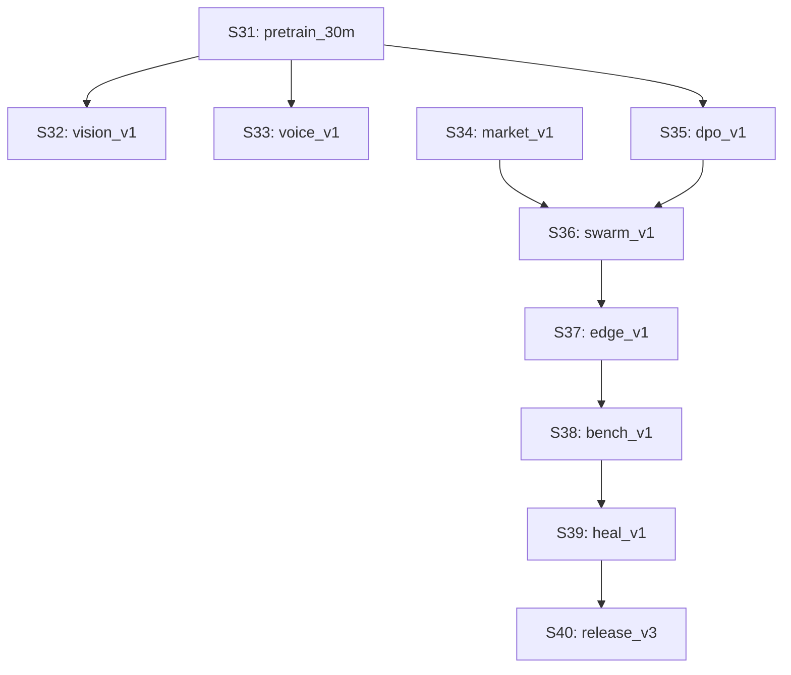

# KrushiVerseAI v3.0 Phase 2 — Autonomous Gen Expansion Plan (Sprints S31–S40)

**Version:** v3.0-Phase2 | **Hardware Target:** NVIDIA RTX 2050 4GB VRAM + Intel i5-13500H + 16GB RAM
**Goal:** Self-Driven Multi-Modal, Real-Time Market, DPO Aligned & Swarm Agent Expansion (Zero Human Touch)

---

## 0. Executive Summary & Strategy

Phase 1 successfully completed **Sprints S18 through S30**, delivering the 15M parameter foundation model (`v0.6-base`), instruction tuning (`v0.7-instruct`), multilingual RAG (`v0.8-agri-qa`), INT8 quantization, and release packaging.

**Phase 2 (S31–S40)** elevates KrushiVerseAI v3 into a **30M parameter Multi-Modal, Real-Time, DPO-Aligned Autonomous Farm Operations Engine**:

1. **Model Scaling (S31)**: Scale base architecture from 15M $\to$ **30M parameters** (`v3-30M`).
2. **Multi-Modal Vision & Voice (S32–S33)**: Leaf crop disease visual diagnosis (`W-VISION`) & regional Marathi/Hindi voice processing (`W-VOICE`).
3. **Real-Time Data Feeds (S34)**: Live APMC mandi price alerts & weather warning sync (`W-MARKET`).
4. **Alignment & Preference Optimization (S35)**: DPO alignment (`W-DPO`) for high-precision agronomic advice.
5. **Multi-Agent Farm Swarm (S36)**: Soil Doctor, Crop Protection Officer, and Market Strategy Swarm (`W-SWARM`).
6. **Edge Micro-Quantization (S37)**: 2-bit / 4-bit GGUF export (`W-EDGE`) for offline farmer smartphones.
7. **Continuous Regression & Healing (S38–S39)**: 5,000 real-query benchmark harness (`W-BENCH`) + Self-Healing worker execution (`W-HEAL`).
8. **Enterprise Microservice Release (S40)**: Multi-region Docker API serving release (`W-RELEASE`).

---

## 1. Phase 2 Task DAG Roadmap (S31 – S40)



---

## 2. Sprint-by-Sprint Plan & Specification

### **Sprint 31: `pretrain_30m` — 30M Scale-Up Base Model**
- **Goal**: Double embedding dimension to 256 and Transformer layers to 8 (`v3-30M`, ~30.5M params).
- **Execution**: Micro-batch 4 with FP16 AMP + gradient checkpointing on RTX 2050 GPU (~1.8 GB VRAM).
- **Worker**: `W-PRETRAIN` (`factory/workers/training_worker.py`).

### **Sprint 32: `vision_v1` — Leaf Disease & Pest Image Classification**
- **Goal**: Train/integrate lightweight ResNet/MobileNet vision encoder for crop leaf diagnosis.
- **Worker**: `W-VISION` (`factory/workers/vision_worker.py`).

### **Sprint 33: `voice_v1` — Vernacular Dialect Audio Processing**
- **Goal**: Audio STT/TTS adapter for Marathi (Ahirani, Varhadi, Konkani) & Hindi agricultural queries.
- **Worker**: `W-VOICE` (`factory/workers/voice_worker.py`).

### **Sprint 34: `market_v1` — Real-Time Mandi Price & Weather Warning Sync**
- **Goal**: Live feed integration with Maharashtra APMC commodity prices & weather warning alerts.
- **Worker**: `W-MARKET` (`factory/workers/market_worker.py`).

### **Sprint 35: `dpo_v1` — Direct Preference Optimization (DPO)**
- **Goal**: Align agronomic advice using DPO pair preferences (preferring exact chemical dosages and safety PPE warnings).
- **Worker**: `W-DPO` (`factory/workers/dpo_worker.py`).

### **Sprint 36: `swarm_v1` — Multi-Agent Farm Manager Swarm**
- **Goal**: Multi-agent orchestration combining Crop Doctor Agent, Soil Health Agent, and Market Officer Agent.
- **Worker**: `W-SWARM` (`factory/workers/swarm_worker.py`).

### **Sprint 37: `edge_v1` — GGUF 2-bit / 4-bit Micro-Quantization**
- **Goal**: Ultra-low memory quantization export for offline low-cost farmer Android devices.
- **Worker**: `W-EDGE` (`factory/workers/edge_worker.py`).

### **Sprint 38: `bench_v1` — 5,000 Real Farm Query Benchmark Harness**
- **Goal**: Automated continuous regression testing on 5,000 real Maharashtra farm queries.
- **Worker**: `W-BENCH` (`factory/workers/bench_worker.py`).

### **Sprint 39: `heal_v1` — Self-Healing & Dynamic Resource Re-balancer**
- **Goal**: Automatic worker failover, memory garbage collection, and dynamic hyperparameter tuning.
- **Worker**: `W-HEAL` (`factory/workers/heal_worker.py`).

### **Sprint 40: `release_v3` — Multi-Region Enterprise Release**
- **Goal**: Enterprise Docker containerization & microservice API server release bundle.
- **Worker**: `W-RELEASE` (`factory/workers/release_worker.py`).

---

## 3. Autonomous One-Command Execution

```bash
# Execute Phase 2 Autonomous Factory Planner
venv\Scripts\python.exe -m factory.planner run --execute --max-cpu-workers 4
```
